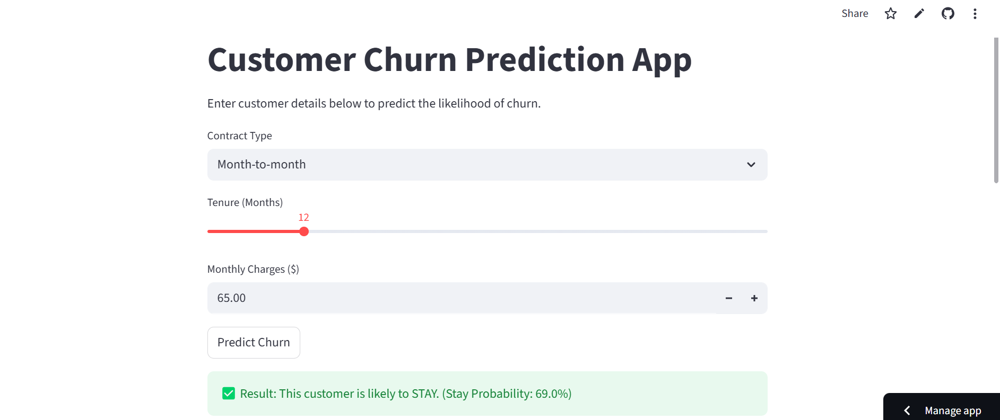

# Customer Churn Prediction 📊

## 🎯 Project Overview
This project aims to predict customer churn (the likelihood of a customer leaving a service) using machine learning. By identifying at-risk customers, businesses can take proactive measures to improve retention.

The application is deployed using Streamlit Cloud and can be accessed here:
https://churnprediction-nhp84jp436ykwogcffxteb.streamlit.app/

## PROBLEM STATEMENT              
 Reducing Customer Attrition in the Telecommunications Sector
The Context: In the highly competitive telecommunications industry, the cost of acquiring a new customer is 5 to 25 times more expensive than retaining an existing one. For a service provider, "Churn" (when a customer cancels their subscription) represents a direct loss of recurring revenue and a decrease in market share.

The Problem: The company is experiencing a significant number of customer cancellations, but the management team lacks a proactive way to identify which customers are likely to leave before they actually do. Currently, the company only reacts after a customer has already requested to cancel, at which point it is often too late to save the relationship.

The Objective: The goal of this project is to build a predictive machine learning model that analyzes historical customer data—specifically focusing on Contract Type, Tenure, and Monthly Charges—to identify high-risk customers in real-time.

## SOLUTION:

 By deploying an interactive web application, the company’s retention team can input customer attributes and receive an immediate risk assessment. This allows the business to:

Identify high-risk individuals with ~80% accuracy.

Intervene with targeted loyalty offers or contract incentives for "Month-to-month" subscribers.

Optimize marketing spend by focusing on customers most likely to churn rather than those who are already loyal.

## DATASET DESCRIPTION:

The dataset used in this project is a collection of customer information from a telecommunications company. It contains 7,043 rows (customers) and 21 columns (features). Each row represents a unique customer, and the columns describe their demographic info, account details, and the services they use.

The Target Variable

The target variable in this dataset is Churn. This is a binary classification, meaning it has two possible outcomes:

Yes (1): The customer left the company (cancelled their service) within the last month.

No (0): The customer stayed with the company (remained loyal).

## FILE USED:

1. app.py (The Interface)
This is the heart of the web application. It uses the Streamlit library to create the sliders and text boxes in the browser. It loads the "brain" and makes the final prediction.

Role: User Interface & Logic.

2. churn_model.pkl (The Brain)
This is the saved Machine Learning model  created during the training phase. It contains all the mathematical patterns the computer learned about customer behavior.

Role: The Intelligence/Predictor.

Format: Pickle (serialized) file.

3. train.py (The Factory)
This script is used to clean the data, select the features (Contract, Tenure, Monthly Charges), and train the Random Forest algorithm. 

Role: Model Training & Development.

4. requirements.txt (The Shopping List)
This is a simple text file that tells Streamlit Cloud which Python libraries it needs to install to run the code. 

Role: Environment Configuration.

## MACHINE LEARNING APPROACH
Algorithm used: Random Forest Classifier.
Purpose: The company can identify "at-risk" customers today and offer them a discount or a better plan before they decide to leave.

## MODEL EVALUATION: 
Accuracy Score.
Confusion matrix.

## PROJECT STRUCTURE
churn_prediction_project/
├── .github/              # (Optional) Created by GitHub for workflows
├── data/                 # (Optional) Folder to store your CSV file
│   └── Telco_Customer_Churn_Dataset.csv
├── app.py                # The main Streamlit web application
├── train.py              # The script used to train the model
├── churn_model.pkl       # The saved "brain" (exported from train.py)
├── requirements.txt      # The list of libraries for the server
└── README.md             # Project documentation and problem statement

## TECHNOLOGY USED
. python 
. pandas
. seaborn sickit-learn
. matplotlib
. seaborn
 
## Application Interface

# Customer Churn Prediction App

## Key Highlights
. End to End Machine Learning Pipeline.
. Business Impact.
. Technical Performance and Scalability.
. Interactive Predictive Analysis.

## Future Improvements

. Create a system where the model automatically retrains itself if new data is added to the database.
. Add a login screen so only authorized employees can access the sensitive customer data.
. Allow a manager to upload a list of 1,000 customers and download a new CSV with a "Risk Score" column added to every row.

## Deployment

The project is deployed using Streamlit Community Cloud.
The app loads trained models from serialized .pkl files and performs real-time predictions based on user input.

